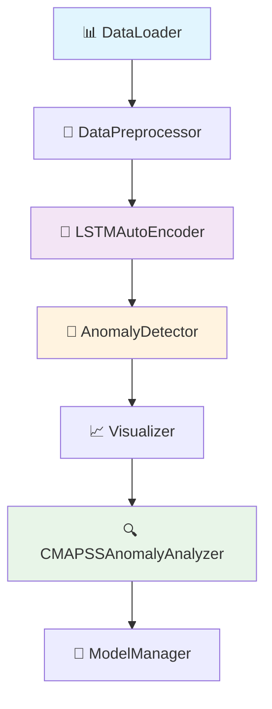
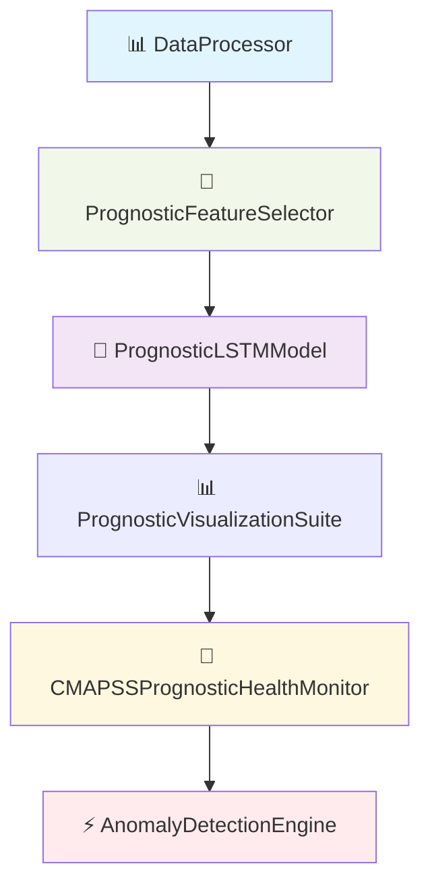

# ✈️ TurboGuard: Turbofan Engine Anomaly Detection

[](https://www.python.org/downloads/)
[](https://tensorflow.org/)
[](https://streamlit.io/)

A deep learning framework for predictive maintenance and anomaly detection in turbofan engines using dual LSTM architectures and the CMAPSS dataset.

## 🎯 Overview

TurboGuard implements a comprehensive anomaly detection and forecasting system for turbofan engines by leveraging two complementary deep learning approaches:

- **LSTM AutoEncoder**: Reconstruction-based anomaly detection through sequence-to-sequence learning
- **Forecasting LSTM**: Next-step prediction for early fault detection

The system provides robust, interpretable insights into engine health, enabling proactive maintenance strategies and reducing operational costs.

## ✨ Key Features

- **Dual Model Architecture**: Combines reconstruction and forecasting approaches for comprehensive anomaly detection
- **Interactive Dashboard**: Real-time Streamlit applications for engine health monitoring and visualization
- **Multivariate Analysis**: Processes 21 sensor channels with temporal dependencies and inter-correlations
- **Modular Design**: Scalable pipeline supporting both research and production deployment
- **Advanced Preprocessing**: Robust data normalization, sequence generation, and feature selection
- **Multiple Detection Methods**: LSTM-based reconstruction error and statistical anomaly detection
- **Comprehensive Evaluation**: Performance metrics including MSE, MAE, precision-recall, and accuracy

## 🏗️ System Architecture

### LSTM AutoEncoder Pipeline


### Forecasting LSTM Pipeline


## 📁 Repository Structure

```
TurboGuard/
├── app/                                  # Streamlit Applications
│   ├── analyzer_app.py                     
│   ├── app.py                             
│   ├── autoencoder_anomaly_detector_app.py 
│   ├── forecaster_anomaly_predictor_app.py 
│   ├── loader_app.py                     # Data loading interface
│   └── preprocessor_app.py                
├── data/                                 # CMAPSS Dataset Files
│   ├── RUL_FD00X.txt                     # Remaining Useful Life labels
│   ├── test_FD00X.txt                    # Test dataset
│   ├── cmpass++.png                      #sonsors infos
│   ├── train_FD00X.txt                   # Training dataset
│   └── readme.txt                        # Dataset documentation
├── data_overview/                        # Data exploration
├── results/                              # Model outputs and metrics
│   ├── autoencoder_/                     # AutoEncoder results
│   └── forecaster/                       # Forecasting model results
├── src/                                  # Core Implementation
│   ├── LSTM_AutoEncoder/                 # AutoEncoder architecture
│   │   ├── anomaly_analyzer.py           
│   │   ├── anomaly_detector.py           
│   │   ├── data_loader.py               
│   │   ├── data_preprocessor.py         
│   │   ├── lstm_autoencoder.py          
│   │   ├── model_manager.py             
│   │   └── visualizer.py               
│   ├── Forecasting_LSTM/                # Prognostic forecasting system
│   │   ├── anomaly_detection_engine.py   
│   │   ├── forecasting_data_processor.py 
│   │   ├── main_training_.py            
│   │   ├── prognostic_LSTMModel.py     
│   │   ├── prognostic_feature_selector.py 
│   │   ├── prognostic_health_monitor.py 
│   │   └── prognostic_visualization_suite.py
│   ├── forecaster_anomaly_predictor_test.py  
│   └── autoencoder_anomaly_predictor_test.py 
├── trained_models/                      # Saved Model Artifacts
│   ├── autoencoder_models/              
│   └── forecaster_model/                
├── requirements.txt                      # Python dependencies
├── README.md
├── Damage Propagation Modeling.pdf      # Technical documentation
└── LICENSE
```

## 🚀 Quick Start

### Prerequisites
- Python 3.8 or higher
- Virtual environment (recommended)
- 6GB+ RAM for model training

### Installation

1. **Clone the repository**
   ```bash
   git clone https://github.com/mouradboutrid/TurboGuard.git
   cd TurboGuard
   ```

2. **Create and activate virtual environment**
   ```bash
   python -m venv turbo_env
   source turbo_env/bin/activate  # On Windows: turbo_env\Scripts\activate
   ```

3. **Install dependencies**
   ```bash
   pip install -r requirements.txt
   ```

4. **Download CMAPSS dataset** (if not included)
   - Place dataset files in the `data/` directory
   - Ensure proper naming convention: `train_FD00X.txt`, `test_FD00X.txt`, `RUL_FD00X.txt`

### Usage Options

#### 1. Interactive Dashboard (Recommended)
Launch the main Streamlit application:
```bash
streamlit run app/app.py
```

#### 2. Specific Model Testing 
- **AutoEncoder Anomaly Detection**:
  ```bash
  run src/autoencoder_anomaly_predictor_test.py
  ```
- **Forecasting-based Prediction**:
  ```bash
  run src/forecaster_anomaly_predictor_test.py
  ```

#### 3. Programmatic Usage
```python
from src.LSTM_AutoEncoder.data_loader import DataLoader
from src.LSTM_AutoEncoder.data_preprocessor import DataPreprocessor
from src.LSTM_AutoEncoder.lstm_autoencoder import LSTMAutoencoder
from src.LSTM_AutoEncoder.anomaly_detector import AnomalyDetector

# Load dataset (returns a dict with keys 'train', 'test', 'rul')
loader = DataLoader(data_dir='/content/drive/MyDrive/CMAPSSData')
dataset = loader.load_dataset('FD001')

train_raw = dataset['train']  # pandas DataFrame
test_raw = dataset['test']    # pandas DataFrame
rul_raw = dataset['rul']      # pandas DataFrame

# Preprocess the train and test data
preprocessor = DataPreprocessor()
train_processed = preprocessor.preprocess_data(train_raw, calculate_rul=True, normalize=True)
test_processed = preprocessor.preprocess_data(test_raw, calculate_rul=False, normalize=True)

# Create sequences from preprocessed data
X_train, y_train = preprocessor.create_sequences(train_processed, sequence_length=50, target_col='RUL')
X_test = preprocessor.create_sequences(test_processed, sequence_length=50)

print("X_train shape:", X_train.shape)
print("X_test shape:", X_test.shape)

# Build and train the LSTM Autoencoder
autoencoder = LSTMAutoencoder()
autoencoder.build_model(input_shape=(X_train.shape[1], X_train.shape[2]))
autoencoder.train(X_train, epochs=50, batch_size=32)

# Detect anomalies on test set
detector = AnomalyDetector()
anomaly_scores, anomaly_flags, threshold = detector.detect_lstm_anomalies(X_test, autoencoder)

print(f"Anomaly threshold: {threshold:.4f}")
print(f"Detected {np.sum(anomaly_flags)} anomalies out of {len(anomaly_flags)} test samples")
print(f"Anomaly rate: {np.sum(anomaly_flags)/len(anomaly_flags)*100:.2f}%")
```

## 🛠️ Core Components

### Data Processing Module (`src/LSTM_AutoEncoder/` & `src/Forecasting_LSTM/`)
- **DataLoader**: Efficient CMAPSS dataset ingestion and validation
- **DataPreprocessor**: Advanced normalization, sequencing, and feature engineering
- **PrognosticFeatureSelector**: ML-based feature selection for optimal prognostic performance

### Model Architectures
- **LSTMAutoEncoder**: Deep LSTM encoder-decoder with attention mechanisms
- **PrognosticLSTMModel**: Multi-horizon forecasting with uncertainty quantification
- **AnomalyDetectionEngine**: Real-time anomaly scoring and adaptive thresholding

### Analysis and Visualization
- **AnomalyAnalyzer**: Comprehensive analysis pipeline with performance benchmarking
- **Visualizer**: Interactive plotting utilities for anomalies and training metrics
- **PrognosticVisualizationSuite**: Advanced 3D visualizations and prognostic dashboards

## 📊 Dataset Information

**CMAPSS Dataset** (Commercial Modular Aero-Propulsion System Simulation by NASA)

| Dataset | Fault Modes | Operating Conditions | Training Engines | Test Engines |
|---------|-------------|---------------------|------------------|--------------|
| FD001   | 1           | 1                   | 100              | 100          |
| FD002   | 1           | 6                   | 260              | 259          |
| FD003   | 2           | 1                   | 100              | 100          |
| FD004   | 2           | 6                   | 248              | 249          |

**Sensor Measurements**: 21 channels including fan speed, core speed, turbine temperatures, pressures, fuel flow, and vibration data.

## 📈 Performance Metrics

### AutoEncoder Model Performance
- **Reconstruction Accuracy**: MSE < 0.15 on validation set
- **Anomaly Detection**: F1-Score > 0.52
- **False Positive Rate**: < 20% on normal operations

### Forecasting Model Performance
- **Early Detection**: 60%+ anomalies detected 20+ cycles before failure
- **Multi-step Forecasting**: Maintains accuracy up to 50-step horizon

## 🔧 Advanced Features

### Multi-Model Anomaly Detection
- **Reconstruction-based**: LSTM AutoEncoder error analysis
- **Prediction-based**: Forecasting deviation detection
- **Statistical Methods**: Distribution-based anomaly scoring
- **Ensemble Approach**: Weighted combination of multiple methods

### Production-Ready Capabilities
- **Model Versioning**: Automated model management and deployment
- **Real-time Processing**: Stream processing for live sensor data
- **Scalable Architecture**: Containerized deployment support
- **Performance Monitoring**: Continuous model performance tracking

### Interpretability and Explainability
- **Attention Visualization**: Understanding model focus areas
- **Feature Importance**: Sensor contribution analysis
- **Anomaly Attribution**: Root cause analysis for detected anomalies

## 🚀 Future Enhancements

- **Multi-Engine Modeling**: Cross-engine anomaly pattern learning
- **Federated Learning**: Distributed training across multiple datasets
- **Edge Deployment**: Lightweight models for embedded systems
- **Digital Twin Integration**: Real-time synchronization with physical engines

## 📚 Documentation

- **Technical Report**: `Damage_Propagation_Modeling.pdf`
- **Readthedocs Documentation**:  [](https://turboguard.readthedocs.io/en/latest/) 

## 🤝 Contributing

We welcome contributions! Please see our contributing guidelines:

1. Fork the repository
2. Create a feature branch (`git checkout -b feature/amazing-feature`)
3. Commit your changes (`git commit -m 'Add amazing feature'`)
4. Push to the branch (`git push origin feature/amazing-feature`)
5. Open a Pull Request

## 📄 License

This project is licensed under the MIT License - see the [LICENSE](LICENSE) file for complete details.

## 👥 Authors

**Boutrid Mourad** - AI Engineering Student
- 📧 Email: muurad.boutrid@gmail.com
- 🔗 LinkedIn: [Mourad Boutrid](https://www.linkedin.com/in/mourad-boutrid-981659336)

**Kassimi Achraf** - AI Engineering Student  
- 📧 Email: ac.kassimi@edu.umi.ac.ma
- 🔗 LinkedIn: [Achraf Kassimi](https://www.linkedin.com/in/achraf-kassimi-605418285)

## 🙏 Acknowledgments

- **NASA** for providing the CMAPSS dataset and establishing benchmarks in prognostics research
- **TensorFlow/Keras Team** for the robust deep learning framework
- **Streamlit** for enabling rapid development of interactive ML applications
- **Open Source Community** for the foundational libraries that made this project possible

---

## 📊 Project Status


**Current Version**: 1.0.0  
**Status**: Active Development  

---

⭐ **If you find TurboGuard helpful for your research or projects, please consider starring this repository!**
